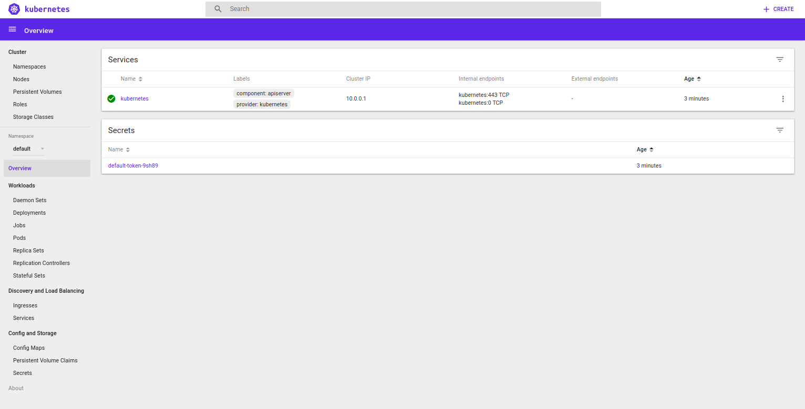

# Docker Machine - Kubernetes Minikube #

*Using a machine to run minikube.*

This sets up a single-node Kubernetes installation, using the regular Boot2Docker ISO.

Tested with minikube version: v0.22.3 (latest) and kubernetes version: v1.8.0 (release)

Written by Anders Björklund (@afbjorklund)

## External URLs ##

Kubernetes

    #KUBERNETES_VERSION=$(curl -s https://storage.googleapis.com/kubernetes-release/release/stable.txt)
    KUBERNETES_VERSION=v1.8.0

``` shell
curl -Lo minikube https://storage.googleapis.com/minikube/releases/latest/minikube-linux-amd64 && chmod +x minikube
curl -Lo localkube https://storage.googleapis.com/minikube/k8sReleases/$KUBERNETES_VERSION/localkube-linux-amd64 && chmod +x localkube
curl -Lo kubectl https://storage.googleapis.com/kubernetes-release/release/$KUBERNETES_VERSION/bin/linux/amd64/kubectl && chmod +x kubectl
```

* 50M	kubectl
* 86M	minikube
* 149M	localkube

Boot2Docker

    # Boot2Docker ISO uses Tiny Core Linux 7.x
    http://repo.tinycorelinux.net/7.x/x86_64/tcz/

* 348K	tcz/bash.tcz
* 4.0K	tcz/bash.tcz.dep
* 4.0K	tcz/bash.tcz.md5.txt
* 196K	tcz/ncurses.tcz
* 4.0K	tcz/ncurses.tcz.md5.txt
* 124K	tcz/readline.tcz
* 4.0K	tcz/readline.tcz.dep
* 4.0K	tcz/readline.tcz.md5.txt
* 688K	total

--------------------------------------------------------------------------------

Creating the machine

    docker-machine create default
    #   --virtualbox-cpu-count "1"
    #   --virtualbox-memory "1024"

``` console
Running pre-create checks...
Creating machine...
(default) Copying /home/anders/.docker/machine/cache/boot2docker.iso to /home/anders/.docker/machine/machines/default/boot2docker.iso...
(default) Creating VirtualBox VM...
(default) Creating SSH key...
(default) Starting the VM...
(default) Check network to re-create if needed...
(default) Waiting for an IP...
Waiting for machine to be running, this may take a few minutes...
Detecting operating system of created instance...
Waiting for SSH to be available...
Detecting the provisioner...
Provisioning with boot2docker...
Copying certs to the local machine directory...
Copying certs to the remote machine...
Setting Docker configuration on the remote daemon...
Checking connection to Docker...
Docker is up and running!
To see how to connect your Docker Client to the Docker Engine running on this virtual machine, run: docker-machine env default
```

Copy to the machine

    docker-machine scp kubectl default:kubectl
    docker-machine scp minikube default:minikube
    # Unfortunately, installing from a file URI seems to be broken (use cache location instead)
    # docker-machine scp localkube default:/mnt/sda1/tmp/localkube
    docker-machine ssh default mkdir -p .minikube/cache/localkube && \
    docker-machine scp localkube default:.minikube/cache/localkube/localkube-$KUBERNETES_VERSION

    # Prime the TCL package manager cache with the packages we need (bash and its dependencies)
    for tcz in tcz/*; do docker-machine scp $tcz default:/tmp/tce/optional/; done

--------------------------------------------------------------------------------

Logging in to machine

    docker-machine ssh default
    
``` console
                        ##         .
                  ## ## ##        ==
               ## ## ## ## ##    ===
           /"""""""""""""""""\___/ ===
      ~~~ {~~ ~~~~ ~~~ ~~~~ ~~~ ~ /  ===- ~~~
           \______ o           __/
             \    \         __/
              \____\_______/
 _                 _   ____     _            _
| |__   ___   ___ | |_|___ \ __| | ___   ___| | _____ _ __
| '_ \ / _ \ / _ \| __| __) / _` |/ _ \ / __| |/ / _ \ '__|
| |_) | (_) | (_) | |_ / __/ (_| | (_) | (__|   <  __/ |
|_.__/ \___/ \___/ \__|_____\__,_|\___/ \___|_|\_\___|_|
Boot2Docker version 17.10.0-ce, build HEAD : 34fe485 - Wed Oct 18 17:16:34 UTC 2017
Docker version 17.10.0-ce, build f4ffd25
```

Installing bash shell

    tce-load -i bash.tcz

``` console
docker@default:~$ tce-load -i bash.tcz
ncurses.tcz: OK
readline.tcz: OK
bash.tcz: OK
```

Installing minikube

    # Unfortunately, installing from a file URI seems to be broken (use cache location instead)
    #sudo -E ./minikube start --vm-driver=none --kubernetes-version=file:///mnt/sda1/tmp/localkube

    export MINIKUBE_WANTUPDATENOTIFICATION=false
    export MINIKUBE_WANTREPORTERRORPROMPT=false
    export MINIKUBE_HOME=$HOME
    export CHANGE_MINIKUBE_NONE_USER=true
    ./minikube config set WantKubectlDownloadMsg false 2>/dev/null # stfu
    sudo -E ./minikube start --vm-driver=none --kubernetes-version=v1.8.0

``` console
Starting local Kubernetes v1.8.0 cluster...
Starting VM...
Getting VM IP address...
Moving files into cluster...
Setting up certs...
Connecting to cluster...
Setting up kubeconfig...
Starting cluster components...
Kubectl is now configured to use the cluster.
===================
WARNING: IT IS RECOMMENDED NOT TO RUN THE NONE DRIVER ON PERSONAL WORKSTATIONS
	The 'none' driver will run an insecure kubernetes apiserver as root that may leave the host vulnerable to CSRF attacks
```

Checking installation

```
> cat ~/.kube/config
apiVersion: v1
clusters:
- cluster:
    certificate-authority: /home/docker/.minikube/ca.crt
    server: https://127.0.0.1:8443
  name: minikube
contexts:
- context:
    cluster: minikube
    user: minikube
  name: minikube
current-context: minikube
kind: Config
preferences: {}
users:
- name: minikube
  user:
    client-certificate: /home/docker/.minikube/client.crt
    client-key: /home/docker/.minikube/client.key
$ sleep 60
$ ./kubectl get pods --all-namespaces
NAMESPACE     NAME                         READY     STATUS    RESTARTS   AGE
kube-system   kube-addon-manager-default   1/1       Running   0          1m
kube-system   kube-dns-6fc954457d-gfbcl    3/3       Running   0          46s
kube-system   kubernetes-dashboard-8v2z5   1/1       Running   0          46s
$ ./kubectl get service -n kube-system kubernetes-dashboard
NAME                   TYPE       CLUSTER-IP   EXTERNAL-IP   PORT(S)        AGE
kubernetes-dashboard   NodePort   10.0.0.144   <none>        80:30000/TCP   1m
```

Leave the machine

    exit

-----------------------------------------------------------------------

### start ssh tunnels

Run ssh in the background

    docker-machine ssh default -L 8443:127.0.0.1:8443 -L 30000:127.0.0.1:30000 -N &

* 8443 (minikube api-server)
* 30000 (dashboard NodePort)

### setup local config

Copy and modify configuration

    docker-machine scp default:.kube/config admin.conf

    docker-machine scp default:.minikube/ca.crt .
    docker-machine scp default:.minikube/client.crt .
    docker-machine scp default:.minikube/client.key .

    sed -e 's|/home/docker/.minikube|.|' -i admin.conf

### kubernetes client

Using tunnel and configuration

    export KUBECONFIG=$PWD/admin.conf

``` console
$ kubectl version
Client Version: version.Info{Major:"1", Minor:"8", GitVersion:"v1.8.0", GitCommit:"6e937839ac04a38cac63e6a7a306c5d035fe7b0a", GitTreeState:"clean", BuildDate:"2017-09-28T22:57:57Z", GoVersion:"go1.8.3", Compiler:"gc", Platform:"linux/amd64"}
Server Version: version.Info{Major:"1", Minor:"8", GitVersion:"v1.8.0", GitCommit:"0b9efaeb34a2fc51ff8e4d34ad9bc6375459c4a4", GitTreeState:"dirty", BuildDate:"2017-10-17T15:09:55Z", GoVersion:"go1.8.3", Compiler:"gc", Platform:"linux/amd64"}
$ kubectl get nodes
NAME      STATUS    ROLES     AGE       VERSION
default   Ready     <none>    1m        v1.8.0
$ kubectl get pods --all-namespaces
NAMESPACE     NAME                         READY     STATUS    RESTARTS   AGE
kube-system   kube-addon-manager-default   1/1       Running   0          2m
kube-system   kube-dns-6fc954457d-bldll    3/3       Running   0          1m
kube-system   kubernetes-dashboard-gc89w   1/1       Running   0          1m
```

-----------------------------------------------------------------------

### minikube dashboard

    xdg-open http://127.0.0.1:30000



### minikube docker-env

    eval $(docker-machine env default)

``` console
$ docker ps
CONTAINER ID        IMAGE                                                  COMMAND                  CREATED             STATUS              PORTS               NAMES
5c90876081b6        gcr.io/google_containers/k8s-dns-sidecar-amd64         "/sidecar --v=2 --..."   6 minutes ago       Up 6 minutes                            k8s_sidecar_kube-dns-6fc954457d-gfbcl_kube-system_faf22751-b71e-11e7-a492-d61753289c7c_0
e5e2c8b10439        gcr.io/google_containers/k8s-dns-dnsmasq-nanny-amd64   "/dnsmasq-nanny -v..."   6 minutes ago       Up 6 minutes                            k8s_dnsmasq_kube-dns-6fc954457d-gfbcl_kube-system_faf22751-b71e-11e7-a492-d61753289c7c_0
33f6c4ee6a32        gcr.io/google_containers/k8s-dns-kube-dns-amd64        "/kube-dns --domai..."   6 minutes ago       Up 6 minutes                            k8s_kubedns_kube-dns-6fc954457d-gfbcl_kube-system_faf22751-b71e-11e7-a492-d61753289c7c_0
afe81f9e5706        gcr.io/google_containers/kubernetes-dashboard-amd64    "/dashboard --inse..."   6 minutes ago       Up 6 minutes                            k8s_kubernetes-dashboard_kubernetes-dashboard-8v2z5_kube-system_fabefb1e-b71e-11e7-a492-d61753289c7c_0
ffa1e9356c6e        gcr.io/google_containers/pause-amd64:3.0               "/pause"                 6 minutes ago       Up 6 minutes                            k8s_POD_kube-dns-6fc954457d-gfbcl_kube-system_faf22751-b71e-11e7-a492-d61753289c7c_0
750992f0c468        gcr.io/google_containers/pause-amd64:3.0               "/pause"                 6 minutes ago       Up 6 minutes                            k8s_POD_kubernetes-dashboard-8v2z5_kube-system_fabefb1e-b71e-11e7-a492-d61753289c7c_0
e97e57d72cdb        gcr.io/google-containers/kube-addon-manager            "/opt/kube-addons.sh"    6 minutes ago       Up 6 minutes                            k8s_kube-addon-manager_kube-addon-manager-default_kube-system_9831e93c3188555873fdb49f43198eef_0
00fc4262d487        gcr.io/google_containers/pause-amd64:3.0               "/pause"                 6 minutes ago       Up 6 minutes                            k8s_POD_kube-addon-manager-default_kube-system_9831e93c3188555873fdb49f43198eef_0
$ docker images
REPOSITORY                                             TAG                 IMAGE ID            CREATED             SIZE
gcr.io/google_containers/k8s-dns-sidecar-amd64         1.14.5              fed89e8b4248        3 weeks ago         41.8MB
gcr.io/google_containers/k8s-dns-kube-dns-amd64        1.14.5              512cd7425a73        3 weeks ago         49.4MB
gcr.io/google_containers/k8s-dns-dnsmasq-nanny-amd64   1.14.5              459944ce8cc4        3 weeks ago         41.4MB
gcr.io/google_containers/kubernetes-dashboard-amd64    v1.6.3              691a82db1ecd        2 months ago        139MB
gcr.io/google-containers/kube-addon-manager            v6.4-beta.2         0a951668696f        4 months ago        79.2MB
gcr.io/google_containers/pause-amd64                   3.0                 99e59f495ffa        17 months ago       747kB
```


